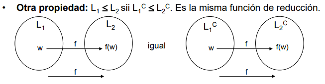

# TCVP 2024 - TP N° 2 #

_Máquina de Turing universal. Indecibilidad. Reducciones._

1. **Ejercicio 1**:
    Probar que el lenguaje LU = {(<M>, w) | M acepta w} pertenece a la clase RE.

    - LU debe estar compuesto por el par (<M>, w), la configuración <M> acepta w. LU pertenece a RE pero no es R. 
    Para poder demostrar que LU es RE se debe crear una MT MU la cual reconoce LU. \
    MU esta compuesto de varias cintas, la primera tendra el par valido, la segunda simulara la entrada de <M> que sera en este caso w, la tercera tendra el estado de <M> para tener registro de este. Si la 3ra cinta llega al estado final significara que <M> aceptó w, al ocurrir esto la MU se detendra. \
    No pertenece a los R ya que no seria posible crear una MT que acepte el complemento de LU. \
    Fuentes: https://www.cs.columbia.edu/~aho/cs3261/Lectures/L16-Universal_Language.html

2. **Ejercicio 2**:
    Justificar o responder según el caso:  
    1. Se puede decidir si una MT M, a partir de la cadena vacía λ, escribe alguna vez un símbolo no blanco. Ayuda: ¿Cuántos pasos puede hacer M antes de entrar en loop?  
        - Dependera que de los estados definidos para la MT M, si acepta λ solamente se detendra, sino lo acepta y posee algun estado que al leer blanco escriba sobre este y continue.
    2. Se puede decidir si a partir de una cadena w, una MT M que sólo se mueve a la derecha se detiene. Ayuda: ¿Cuántos pasos puede hacer M antes de entrar en loop? 
        - En ese caso la máquina solo procesara w e irá a la derecha hasta llegar a B. La cantidad de pasos estara determinada por la longitud de w. 
    3. Se puede decidir, dada una MT M, si existe una cadena w a partir de la cual M se detiene en a lo sumo 10 pasos. Ayuda: ¿Hasta qué tamaño de cadenas hay que chequear? 
        - Es posible si se registra la cantidad de movimientos en una segunda cinta o con los estados definidos para la máquina M.
    4. Intuitivamente, ¿se puede decidir, dada una MT M, si existe una cadena w de a lo sumo 10  símbolos a partir de la cual M para? 
        - Es posible si por empezar la cadena w pertenece a L(M) y si esta cumple de ser a los sumo de 10 símbolos.

3. **Ejercicio 3**:
    Considerando la reducción de HP a LU descripta en clase, responder:
    1. Explicar por qué la función identidad, es decir la función que a toda cadena le asigna la misma cadena, no es una reducción de HP a LU.
        - Ya que la función identidad es producto de la función de reducción, no es la reducción de un lenguaje L a otro. Esta ligada a la propiedad de reflexividad.
    2. Explicar por qué las MT M´ generadas en los pares (<M´>, w), o bien se detienen aceptando, o bien loopean
        - En el caso de que la M´ sea válida siempre se detendra ya que la M' va a aceptar al cadena w, en el caso alterno que loopeen es debido a que la (<M´>, w) no es una codificación valida o no pertenece al lenguaje HP.  
    3. Explicar por qué la función utilizada para reducir HP a LU también sirve para reducir HPC a $LU^C$
        - 
    4. Explicar por qué la función utilizada para reducir HP a LU no sirve para reducir LU a HP
        - Porque no se cumple simetria, HP <= LU no implica LU <= HP
    5. Explicar por qué la siguiente MT Mf no computa una reducción de HP a LU: dada una cadena válida (<M>, w), Mf ejecuta M sobre w, si M acepta entonces genera el par de salida (<M>, w), y si M rechaza entonces genera la cadena 1.
        - No deberia generar la cadena 1, sino deberia generar un par igualmente de salida, el tema es que en el caso de que M al ser HP no deberia rechazar, simplemente va a loopear, por ende no pertenece a HP.
    
4. **Ejercicio 4**:
    Sea el lenguaje DHP = {wi | Mi para desde wi, según el orden canónico}. Encontrar una reducción de DHP a HP.
    - Para poder encontrar una reducción sera necesario construir una MT M1 que compute una MTDHP que acepte DHP y otra MTHP. MTDHP ignorara la entrada y , debera simular Mi, una vez Mi llega a wi, se detendra y debera retornar una f(w) que en este caso debera ser (<M'>,w) que debe ser entendible para la MHP, si MHP se detiene M acepta. 

5. **Ejercicio 5**:
    Sean TAUT y NOSAT los lenguajes de las fórmulas booleanas sin cuantificadores,  respectivamente, tautológicas (satisfactibles por todas las asignaciones de valores de verdad), e  insatisfactibles  (ninguna  asignación  de  valores  de  verdad  las  satisface).  Encontrar  una reducción de TAUT a NOSAT.
    - Para encontrar una reducción de TAUT a NOSAT deberemos crear la formula ¬φ. Esta sera aceptada por TAUT (sera tautológica) y en el caso de que solo sea φ sera insatisfactible.
    Al tomar la formula φ la negamos y tendremos ¬φ. 
    - Si ¬φ es tautológica, entonces φ no insatisfactible.
    - Si ¬φ no es tautológica, entonces φ es satisfactible, por ende no pertence a NOSAT.

6. **Ejercicio 6**:
    Un autómata linealmente acotado (ALA) es una MT con u na sola cinta, con  la restricción de que su cabezal sólo puede moverse a lo largo de las celdas ocupadas por la cadena de entrada. Probar que el lenguaje aceptado por un ALA  es recursivo. Ayuda: ¿en cuántos pasos se puede detectar que el ALA entra en loop?
    -  Se puede probar que el lenguaje aceptado por un ALA es recursivo ya que existe una maquina que lo acepta y siempre para(Definición de Lenguaje Recursivo). Relacionado con la ayuda, es posible detectar cuando ALA loopea debido a la configuración que esta posee. P = |w|.|Q|.|Σ|^|w|
7. **Ejercicio 7**:
    Construir una MT que genere todos los índices i tales que (<Mi>, wi) ∈ HP, según el orden canónico.
    - Para construir la MT debemos seguir un conjunto de pasos:

        1. Se debera inicializar el índice i en 1.
        2. Se codifica la i-esima MT en orden canónico como Mi.
        3. Se ejecuta Mi con wi.
        4. Si Mi se detiene con wi, se imprime en f(w).
        5. Se incrementa i en 1 y vuelve al paso 2.
